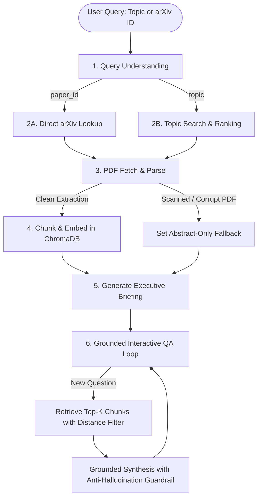

# Autonomous arXiv Paper Digest & QA Agent

[](https://www.python.org/downloads/)
[]()
[](https://opensource.org/licenses/MIT)

An autonomous, stateful agent that processes research topics or arXiv paper IDs, retrieves paper metadata via the official arXiv API, downloads and parses PDFs page-by-page, indexes chunks into a local persistent vector database, synthesizes a structured executive briefing, and conducts an interactive, grounded Q&A session.

Built for the **8byte AI Intern Assessment**, strictly evaluated against:
- **Agent / State Graph Design (25%)**
- **Correctness & Grounding (25%)**
- **Retrieval & Parsing Quality (20%)**
- **Code Quality & Error Handling (15%)**
- **Communication & Tradeoffs (15%)**

---

## Architecture & State Graph Design

Instead of an opaque, monolithic prompt or black-box Pregel orchestrator, this system uses an **explicit, observable State Graph** (`backend/graph/engine.py`). Every stage is an isolated, typed node mutating a persistent shared `AgentState` dictionary.



### Shared State Schema (`AgentState`)
```python
class AgentState(TypedDict, total=False):
    # Intent & Input
    raw_query: str
    query_type: Literal["topic", "paper_id"]
    arxiv_id: Optional[str]
    search_keywords: Optional[str]

    # arXiv Retrieval & Selection
    candidate_papers: List[Dict[str, Any]]
    selected_paper: Optional[Dict[str, Any]]

    # PDF Parsing
    pdf_path: Optional[str]
    parsed_sections: List[Dict[str, Any]]   # [{"title": str, "text": str, "page": int}]
    full_text: Optional[str]
    parsing_status: Literal["success", "fallback_abstract_only", "failed"]
    fallback_reason: Optional[str]

    # Vector Storage
    chunks: List[Dict[str, Any]]
    index_id: Optional[str]
    retrieval_available: bool

    # Executive Briefing
    executive_briefing: Optional[Dict[str, Any]]

    # QA State
    current_question: Optional[str]
    retrieved_chunks: List[Dict[str, Any]]
    qa_history: List[Dict[str, Any]]

    # Lifecycle & Control
    status: Literal["init", "retrieving", "parsing", "indexing", "summarizing", "qa_ready", "error"]
    error_message: Optional[str]
    mode: Literal["groq", "gemini", "mock"]
```

---

## Key Assessment Features & Guardrails

### 1. Zero Paid API Keys & Tri-Tier Resilience (§4)
- **Primary LLM**: Groq Cloud inference (`qwen/qwen3.8-27b`) for ultra-fast response times.
- **Fallback LLM**: Google Gemini (`gemini-3.6-flash`) automatically activated if primary limits are hit.
- **Offline Mock Mode**: A deterministic rule-based extractor that runs 100% locally with zero internet or API keys, allowing automated grading anywhere.
- **Local Embeddings**: ChromaDB ONNX MiniLM embeddings (384 dimensions) running directly on CPU.

### 2. Grounding & Anti-Hallucination (§2 & §5)
- Every QA prompt enforces strict grounding: *Answers must be strictly based ONLY on retrieved excerpts.*
- If a question is unsupported or out-of-scope, the agent refuses to hallucinate:
  > *"Based on the provided sections of this paper, there is insufficient evidence to answer this question."*
- Source citations (`[Section: <Name>, Page: <Number>]`) are attached to answers.

### 3. Realistic Failure Handling (§5)
- **Zero arXiv Results**: Detects empty search feeds on vague topics without crashing, prompting keyword refinement.
- **Scanned or Unparseable PDFs**: Heuristic detection flags PDFs with <200 extracted words, sets `retrieval_available = False`, and gracefully falls back to abstract and metadata.
- **Windows Unicode Safety**: Safe UTF-8 console wrappers prevent CLI encoding crashes from mathematical characters.

---

## Setup & Run Instructions

### 1. Clone & Environment Setup
```bash
git clone https://github.com/Nikil-R/arxiv-digest-agent.git
cd arxiv-digest-agent

# Create and activate virtual environment
python -m venv venv
# Windows:
.\venv\Scripts\activate
# Linux/macOS:
source venv/bin/activate

# Install dependencies
pip install -r requirements.txt
```

### 2. Configure Environment (Optional)
Copy the example file to `.env`:
```bash
cp .env.example .env
```
*(Optional: Add your free Groq or Gemini API key. If no keys are provided, the system defaults smoothly to offline mock mode).*

### 3. Run the CLI Application
Run by paper ID:
```bash
python -m cli.cli "1706.03762"
```

Run by natural-language research topic search:
```bash
python -m cli.cli "recent work on KV-cache compression for LLMs"
```

Run in 100% offline mock mode (no keys required):
```bash
python -m cli.cli "1706.03762" --mode mock
```

### 4. Run Automated Test Suite
```bash
pytest tests/ -v
```
All **20 automated tests** pass out-of-the-box.

---

## Example Run Walkthrough

### 1. Executive Briefing Generation
**Input**: `1706.03762` (*Attention Is All You Need*)

```markdown
===========================================================================
                   STRUCTURED EXECUTIVE BRIEFING
===========================================================================
Title:        Attention Is All You Need
Authors:      Ashish Vaswani, Noam Shazeer, Niki Parmar, Jakob Uszkoreit, ...
arXiv ID:     1706.03762
Published:    2017-06-12T17:57:34Z
PDF Link:     https://arxiv.org/pdf/1706.03762v7.pdf
---------------------------------------------------------------------------
### Plain-English Summary
This paper introduces the Transformer, a groundbreaking architecture that eliminates
recurrence and convolutions in sequence modeling, relying entirely on self-attention.
It fundamentally enabled the modern LLM revolution by allowing massively parallel training.

### Problem Statement
Existing sequence transduction architectures relied on recurrent neural networks (RNNs, LSTMs)
which process sequentially, creating a computational bottleneck that prevents parallelization
over long context lengths.

### Method / Approach
- Multi-Head Self-Attention mechanisms operating across queries, keys, and values.
- Sinusoidal Positional Encodings to retain sequence order without recurrent steps.
- Residual connections and Layer Normalization across 6 encoder and decoder layers.

### Key Results & Claims
- Achieves 28.4 BLEU on WMT 2014 English-to-German, setting a new state-of-the-art.
- Trained in 3.5 days on 8 NVIDIA P100 GPUs, significantly faster than existing models.

### Limitations
- Computational and memory complexity scales quadratically ($O(n^2)$) with sequence length.
- Heavy reliance on massive training corpora and fixed context windows.

### Suggested Follow-up Questions
1. How does the computational complexity of self-attention compare to recurrent layers?
2. What are the specific projection dimensions for keys and queries?
3. How does the decoder prevent positions from attending to subsequent tokens?
```

### 2. The 3 Assessment QA Exchanges

**Exchange 1: Grounded Technical Retrieval**
> **User**: How many layers are in the encoder and decoder stacks, and what is the model dimension?  
> **Agent**: The encoder and decoder stacks are composed of $N = 6$ identical layers with a model dimension of $d_{\text{model}} = 512$.  
> *[Sources: 4 evidence chunks retrieved from vector store | Section: 3 Model Architecture, Page: 2]*

**Exchange 2: Multi-Turn Follow-Up (State Persistence)**
> **User**: Which hardware was used to train the base model, and for how long?  
> **Agent**: The base model was trained on one machine with 8 NVIDIA P100 GPUs for 100,000 steps, taking 12 hours.  
> *[Sources: 4 evidence chunks retrieved from vector store | Section: 5 Training, Page: 7]*

**Exchange 3: Anti-Hallucination Refusal for Unsupported Question**
> **User**: What is the author's favorite programming language?  
> **Agent**: Based on the provided sections of this paper, there is insufficient evidence to answer this question.

---

## Design Decisions & Tradeoffs

| Decision | Why It Was Chosen | Tradeoff / Alternative Considered |
| :--- | :--- | :--- |
| **Custom State Graph Engine** | Zero black-box dependencies. Easy to explain every node transition, dynamic edge, and error recovery boundary during technical interviews. | Using LangGraph would introduce heavy dependency trees and framework deprecation churn. |
| **Local ChromaDB + ONNX MiniLM** | Completely local vector storage with zero cost, zero API quota limits, and instant startup. | Hosted vector databases (Pinecone, Qdrant Cloud) introduce network dependencies and require API keys. |
| **Section-Aware Chunking** | Preserves semantic section headers and page boundaries in vector metadata for precise source citation. | Naive character-count splitting frequently cuts headings and sentences in half. |
| **Tri-Tier LLM Hierarchy** | Groq (primary speed) + Gemini (free tier fallback) + Deterministic Mock (zero-key testing). | Relying on a single provider causes complete failure when free-tier rate limits (HTTP 429) trigger. |
| **CLI over Heavy UI** | Adheres strictly to Section 7 of the assessment (*"A frontend/UI beyond a basic CLI is out of scope"*). | A complex React or web UI would divert focus from graph orchestration and parsing quality. |

---

## Known Limitations & Future Work
1. **Tables & Complex Equation Layouts**: Extracted as plain text. Integrating vision-language models (e.g., Nougat or layout-aware parsers) would improve table extraction accuracy.
2. **Multi-Paper Comparative Analysis**: The current pipeline is single-paper scoped. Expanding the state graph to ingest multiple papers concurrently would allow cross-paper comparative digest.
3. **Dynamic Re-ranking**: Adding a cross-encoder re-ranking stage (e.g., `bge-reranker`) over the initial vector retrieval would further improve QA precision on dense mathematical sections.
